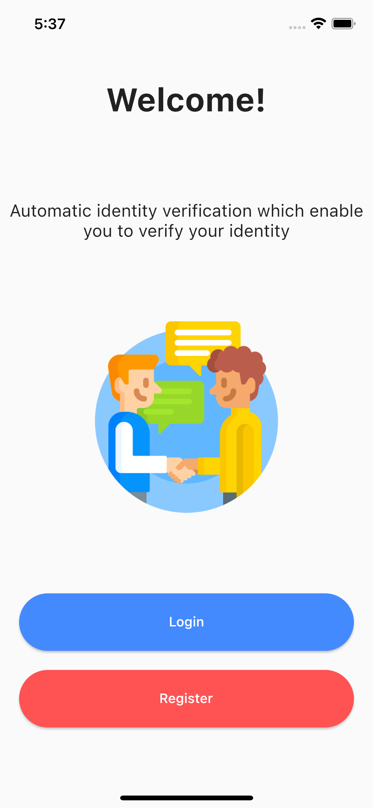
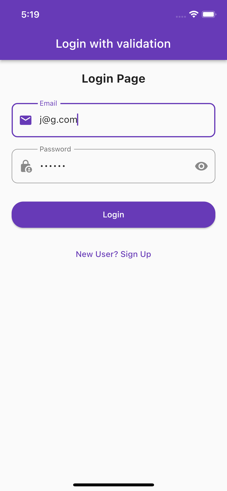
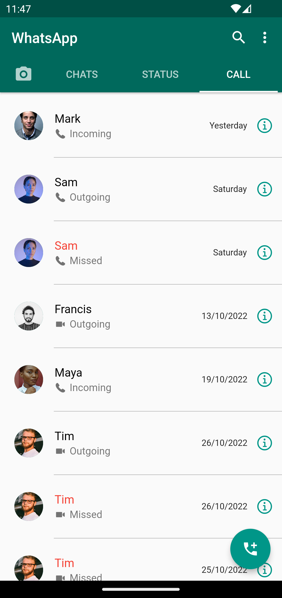
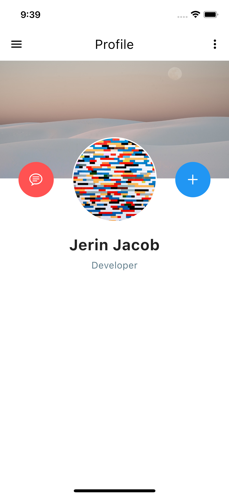

# flutter_ui

Repository showcasing different UI examples using Flutter.

## Screenshots

<table>
  <tr>
    <td align="center">Splash Screen</td>
    <td align="center">Welcome Screen</td>
    <td align="center">Login Form</td>
    <td align="center">Sign Up Form</td>
  </tr>
  <tr>
    <td align="center"></td>
    <td align="center"></td>
    <td align="center"></td>
    <td align="center"></td>
    
  </tr>
</table>

<table>
  <tr>
    <td align="center">ListTile Example</td>
    <td align="center">CheckBox ListTile</td>
  </tr>
  <tr>
    <td align="center"></td>
    <td align="center"></td>
  </tr>
</table>

### WhatsApp iOS UI

<table>
  <tr>
    <td align="center">Chats</td>
    <td align="center">Status</td>
    <td align="center">Calls</td>
  </tr>
  <tr>
    <td align="center"></td>
    <td align="center"></td>
    <td align="center"></td>

  </tr>
</table>

### WhatsApp Android UI

<table>
  <tr>
    <td align="center">Chats</td>
    <td align="center">Status</td>
    <td align="center">Calls</td>
  </tr>
  <tr>
    <td align="center"></td>
    <td align="center"></td>
    <td align="center"></td>

  </tr>
</table>

### Other UIs

<table>
  <tr>
    <td align="center">Profile UI using Stack</td>
    <td align="center">E-commerce Home UI</td>
    <td align="center">Hotel Home UI</td>
   
  </tr>
  <tr>
    <td align="center"></td>
    <td align="center"></td>
    <td align="center"></td>
    
  </tr>
</table>

<table>
  <tr>
    <td align="center">Profile UI</td>
    <td align="center">Blog UI</td>
    <td align="center">Farmers Fresh UI</td>

  </tr>
  <tr>
    <td align="center"></td>
    <td align="center"></td>
    <td align="center"></td>
    
  </tr>
</table>

<table>
  <tr>
    <td align="center">Animated Switcher UI</td>
  </tr>
  <tr>
    <td align="center"></td>
    
  </tr>
</table>

