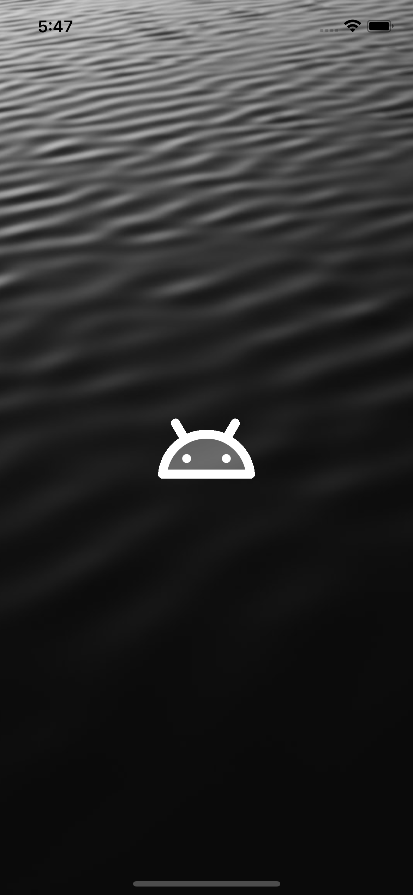

# flutter_ui

A new Flutter project showcasing different UI examples.

## Screenshots

<table>
  <tr>
    <td align="center">Splash Screen</td>
    <td align="center">Welcome Screen</td>
    <td align="center">Login Form</td>
    <td align="center">Sign Up Form</td>
    <td align="center">ListTile Example</td>
  </tr>
  <tr>
    <td align="center"></td>
    <td align="center"></td>
    <td align="center"></td>
    <td align="center"></td>
    <td align="center"></td>
  </tr>
</table>
